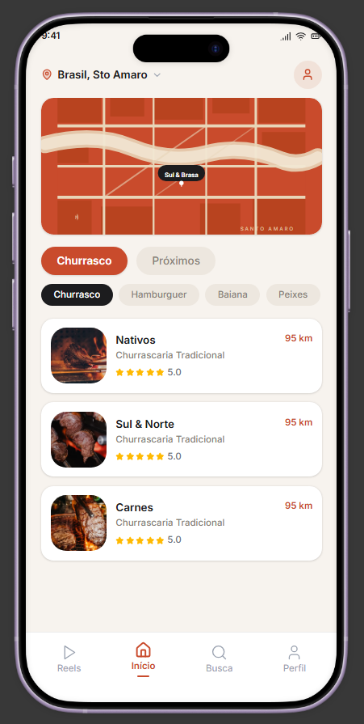
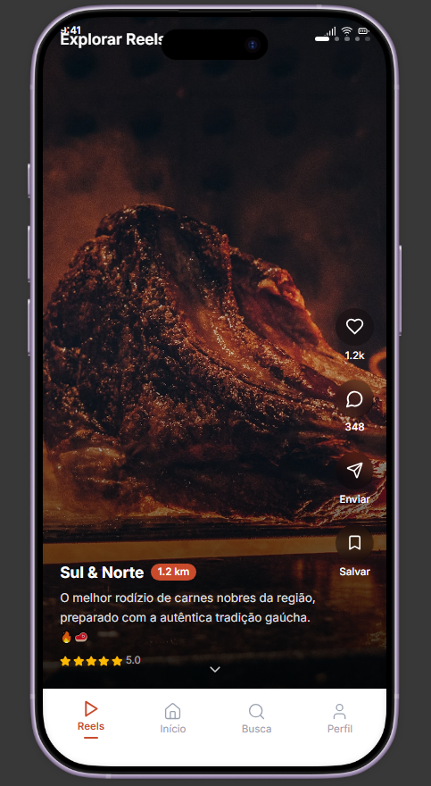
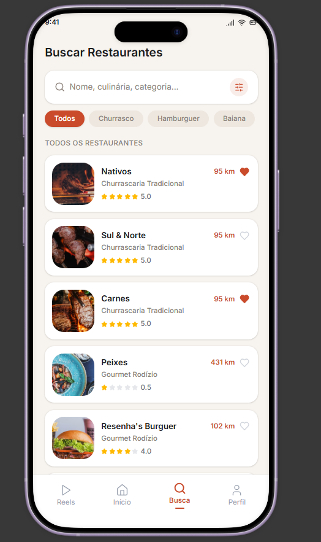
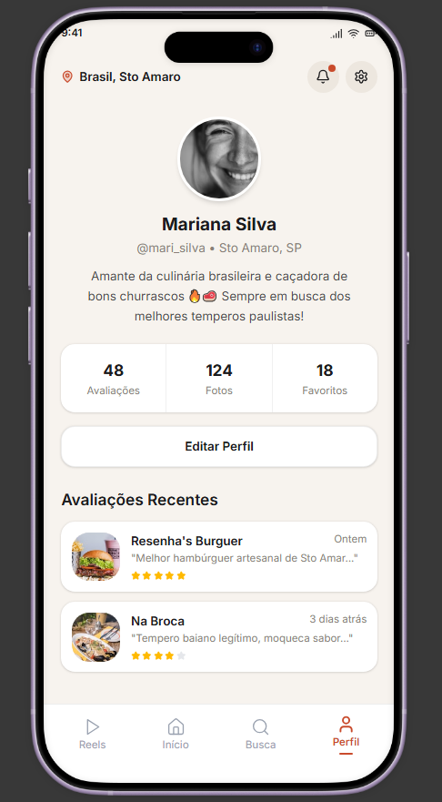

# Food Finder

## Sobre o projeto

Food Finder é o protótipo funcional (front-end) de um aplicativo mobile de descoberta e reserva de restaurantes na região de **Santo Amaro, São Paulo**. O protótipo foi gerado a partir de um design no **Figma** ("Rebuild functional prototype") e implementado em **React 18 + TypeScript**, com **Vite** como bundler, **Tailwind CSS v4** e componentes **shadcn/ui** (Radix UI) para a interface.

A tela é renderizada dentro de uma moldura de smartphone (com status bar simulada) e navegação por abas inferiores, reproduzindo fielmente a experiência de um app nativo dentro do navegador. Todo o conteúdo (restaurantes, avaliações, reels e perfil) vem de dados mockados em `src/app/data.ts` — não há backend, API externa ou persistência real: é uma casca de interface (UI shell) para validar a experiência de produto antes do desenvolvimento nativo/definitivo.

## Problema

Encontrar um bom restaurante nas proximidades costuma exigir alternar entre vários aplicativos diferentes: um para ver localização e distância, outro para ler avaliações, redes sociais para ver fotos/vídeos do local e, por fim, um telefonema ou app à parte para reservar mesa. Esse processo fragmentado torna a decisão mais lenta, e a maioria dos apps de descoberta gastronômica não oferece um formato visual e imersivo (como vídeos curtos) que ajude o usuário a decidir rapidamente onde comer.

## Solução proposta

O Food Finder concentra essa jornada em um único fluxo mobile, unindo:

- **Descoberta visual em formato de vídeo curto** (estilo Reels), com curtidas, comentários e opção de salvar;
- **Exploração por categoria de culinária ou por proximidade**, com mapa ilustrativo e lista de restaurantes;
- **Busca com filtros** por nome, categoria e tipo de culinária;
- **Página de detalhes do restaurante**, com fotos, nota, endereço, horário de funcionamento, tags e avaliações de outros usuários;
- **Reserva de mesa integrada**, com seleção de data, horário, número de pessoas e confirmação de dados de contato;
- **Perfil do usuário**, com estatísticas (avaliações, fotos, favoritos) e histórico de avaliações recentes.

## Telas desenvolvidas

<table>
<tr>
<td align="center" width="25%">

**Início**



</td>
<td align="center" width="25%">

**Reels**



</td>
<td align="center" width="25%">

**Busca**



</td>
<td align="center" width="25%">

**Perfil**



</td>
</tr>
</table>

- **Reels** (`ReelsScreen`) — feed vertical em tela cheia de vídeos/imagens dos restaurantes, navegável por swipe/scroll, com curtir, comentar, enviar e salvar, além de uma tela de "fim do feed" com opção de reiniciar
- **Início / Home** (`HomeScreen`) — alterna entre visão por categoria de culinária (Churrasco, Hambúrguer, Baiana, Peixes) com mapa ilustrativo no topo, e visão "Próximos", que lista os restaurantes ordenados por distância
- **Busca** (`SearchScreen`) — campo de busca por nome/categoria combinado com chips de filtro por culinária, exibindo contagem de resultados ou estado de "nenhum resultado"
- **Detalhe do restaurante** (`RestaurantDetail`) — abre como um overlay sobre a tela atual, com imagem de capa, distância, faixa de preço, nota, endereço, horário de funcionamento, tags/características e lista de avaliações, além do botão para iniciar uma reserva
- **Reserva** (`ReservationModal`) — modal inferior (bottom sheet) para escolher data, horário (em blocos pré-definidos de almoço e jantar), número de pessoas (limitado à quantidade de mesas do restaurante), nome e telefone/WhatsApp, com tela de confirmação ao final
- **Perfil** (`ProfileScreen`) — dados do usuário (nome, localização, bio), estatísticas de avaliações/fotos/favoritos e lista de avaliações recentes feitas pelo usuário
- **Navegação inferior** (`BottomNav`) — barra fixa com quatro abas (Reels, Início, Busca, Perfil) que controla qual tela é exibida

> Observação: o "mapa" exibido na Home é uma ilustração em SVG estático (não usa uma API de mapas real), e todos os dados de restaurantes, avaliações e perfil são fixos no código (`src/app/data.ts`), servindo para demonstrar a navegação e o layout do protótipo.

## Link do projeto no Figma

[Rebuild functional prototype](https://www.figma.com/design/jrzlzM17v8iKMtnAJuNX58/Rebuild-functional-prototype)

---

### Executando o projeto localmente

```bash
npm i
npm run dev
```

Isso inicia o servidor de desenvolvimento do Vite. Para gerar a build de produção, use `npm run build`.

### Créditos

Este projeto usa componentes do [shadcn/ui](https://ui.shadcn.com/) (licença MIT) e fotos do [Unsplash](https://unsplash.com) (licença Unsplash), conforme detalhado em `ATTRIBUTIONS.md`.
